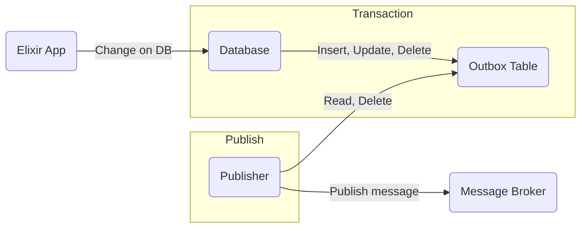
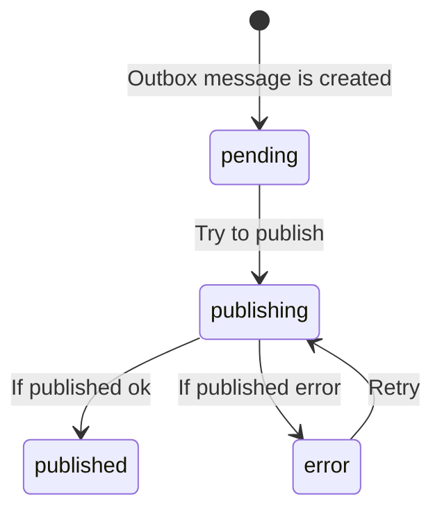

# Outbox

A service command typically needs to create/update/delete aggregates in the database and send messages/events to a message broker. The command must atomically update the database and send messages in order to avoid data inconsistencies and bugs.

Ok, then... how to atomically update the database and send messages to a message broker?

The solution is for the service that sends the message to first store the message in the database as part of the transaction that updates the business entities. A separate process then sends the messages to the message broker. In other words, **Transactional outbox** pattern (aka **Outbox pattern**).

`Outbox` is a library that provide [transactional outbox](https://microservices.io/patterns/data/transactional-outbox.html) pattern support in Elixir.

To learn more and get started, check out [our guides and docs](https://hexdocs.pm/outbox).

<div align="center">
  
</div>

## How it works

Basically the **Transactional outbox** pattern provides an “Outbox” table in the microservice’s database and the event written to the outbox table are part of the same transaction. The second step is to receive these events written to the outbox table by an independent service and write them to the event bus.



The participants in this pattern are:

- Elixir App - the service that sends the message
- Database - the database that stores the business entities and message outbox
- Message outbox - the table that stores the messages to be sent
- Publisher - sends the messages stored in the outbox to the message broker

:warning: This pattern also has the following issues:

- The Message relay might publish a message more than once (at least once delivery policy). It might, for example, crash after publishing a message but before recording the fact that it has done so. When it restarts, it will then publish the message again.

### Message lifecycle



### Observability

`Outbox` uses [Telemetry](https://hex.pm/packages/telemetry) for instrumentation and for having an extensible way of doing logging. Telemetry is a metrics and instrumentation library for Erlang and Elixir applications that is based on publishing events through a common interface and attaching handlers to handle those events. For more information about the library itself, see [its README](https://github.com/beam-telemetry/telemetry).

For information on the Telemetry events that Redix emits, see `Redix.Telemetry`.

If you want control on how Redix events are logged or on what level they're logged at, you can use your own event handler. For example, you can create a module to handle these events:

```elixir
    defmodule MyApp.OutboxTelemetryHandler do
      @moduledoc false
      require Logger

      def handle_event([:outbox, event], measurements, metadata, :no_config)
        when event in [
               :events_published,
               :events_error,
               :events_cleaned,
               :events_recovered
             ] do
        Logger.debug("#{inspect(event)} event received with metadata #{inspect(metadata)} and measurements #{inspect(measurements)}")
        # TODO
      end

      def handle_event([:outbox, :publish, _stage] = event, measurements, metadata, :no_config) do
        Logger.debug(
          "#{inspect(event)} event received with metadata #{inspect(metadata)} and measurements #{inspect(measurements)}"
        )
        # TODO
      end
    end

Once you have a module like this, you can attach it when your application starts:

    events = [      
        [:outbox, :events_published],
        [:outbox, :events_error],
        [:outbox, :events_cleaned],
        [:outbox, :events_recovered],
        [:outbox, :publish, :stop],
        [:outbox, :publish, :exception]
    ]

    :telemetry.attach_many(
        "telemetron-outbox-telemetry-handler",
        events,
        &handle_event/4,
        :no_config
      )
```

- `[:outbox, :events_error]`:  When an error happens publishing the event(s) (receiving the delta / number of errors as measurements and type of event as metadata).
- `[:outbox, :events_published]`: - When outbox event(s) are published successfuly (receiving the delta / number of published events as measurements and type of the event as metadata).
- `[:outbox, :events_cleaned]`: - When outbox event(s) are removed from outbox table successfully (receiving the delta / number of cleaned events as measurements and type of the event as metada).
- `[:outbox, :events_recovered]`: - When outbox event(s) are recovered chenging its state from publishing to pending (receiving the delta  / number of recovered events as measurements and type of the event as metadata).
- `[:outbox, :publish , :stop|:exception]`: - When an outbox event run publish (receiving the duration of the operation in seconds as measurements and type of the event as metadata)

## Installation

`Outbox` is available on [Hex](https://hex.pm/packages/outbox). To install, just add it to your dependencies in `mix.exs`:

```elixir
def deps do
  [
    {:outbox, "~> 0.0.1"}
  ]
end
```

Define an outbox module, associated with the Repo and the publisher of your application:

```elixir
defmodule MyApp.MyOutbox do
  use Outbox, repo: MyApp.Repo, publisher: MyApp.Publisher

  # Optional, encodes the body of the message to its string representation.
  def encode(body) do
    Jason.encode!(body)
  end
end
```

Finally, you should start the `Outbox` instance in your supervision tree:

```elixir
defmodule MyApp.Application do
  def start(_type, _args) do
    children = [
      MyApp.Repo,
      MyApp.MyOutbox,
      ...
    ]
  end
end
```

Done! Now you can publish messages!. Try it out with:

```elixir
  # Outbox message must be created inside a transaction
  repo.transaction(
    fn ->
      # ...
      MyApp.MyOutbox.outbox!("message_type", %{field_1: :value_1})
  end)
```

### Configuration

`Outbox` accepts the following opts:

- `:repo`: the repo where messages will be read from. Usually should be the same repo that you're writing to. **Mandatory**.
- `:publisher`: module responsible to emit the outbox message to an external messagery broker. **Mandatory**.  This module needs to implement a `publish/1` function where a `Outbox.Types.OutboxEvent` data is going to be sent.
- `:reader_poll_interval_ms`: Reader time between polling checking for pending messages to be sent. By default: 10_000.
- `:consumer_min_demand`: Minimal demand configured for the consumer (ack), producer_consumer(publisher). By default `0`. See `GenStage` documentation for more info.
- `:consumer_max_demand`: Minimal demand configured for the consumer (ack), producer_consumer(publisher). By default `1`. See `GenStage` documentation for more info.
- `:rescuer_interval_ms`: Rescuer process interval. By default `:timer.seconds(15)`.
- `:rescuer_limit_ms`: The time limit for records to be in the publishing state. By default `:timer.seconds(15)`.
- `:cleaner_interval_ms`: Cleaner process interval. By default `:timer.seconds(30)`.
- `:cleaner_limit_ms`: Cleaner time window (retention policy). By default `:timer.hours(168)`.
- `:query_opts`: Additional options for internal queries. By default `[log: false]`.
- `:acknowledger_max_demand`: Tell the `Outbox.Pipeline.AcknowledgerSupervisor` how many processes it needs to start according to the demand.
